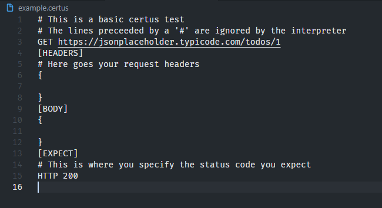

# CERTUS
certus is a basic and easy to use http test runner.

# Installation

## Windows
- Download the zipped folder from the releases page
- Extract it and you will get a folder that contains the certus executable and a batch file
- Move the extracted folder to c:\Program Files\
- Add the folder to your PATH

## Ubuntu
- Download the certus executable from the releases page
- Make it executable by running **chmod +x certus**
- Move the executable under /usr/bin/certus

## Build from source
certus is written in Rust, just clone this repository and run
**cargo build** to build it for your operating system

# Usage
To quickly generate a certus file, run **certus generate example.certus**

This will create a new file named "example.certus" that contains boilerplate for certus files.
It usually looks like this

A certus file contains 4 parts, the first part is where you define the method and the url to send the request to:

`GET https://jsonplaceholder.typicode.com/todos/1` means that you want to send a GET request to the specified url. certus will error out if the url is not a valid http endpoint. You can also use lowercase for methods so get and GET are valid, but gET is not valid

When certus sees the [HEADERS] delimiter it knows that you want to configure the headers for your request. You can paste any valid json under the delimiter and it will get parsed as the headers for your request. See the example.certus file for more

The [BODY] delimiter marks the end of the header. By default the body is json, raw strings are not supported yet.

And last the [EXPECT] delimiter marks the end of the body and it is the part where you tell certus what response status you expect by using the syntax **HTTP status_code**.

# Roadmap
In the coming version certus will be able to validate the headers and body of the response. It will also be able to run multiple tests when passed a directory and even multiple tests in a certus file. certus will also be able to do benchmarks.

# Contribution
Contributions are welcome, as an open source noob I don't really have any contribution rule so just feel free to make a pull request. Just create an issue if you encounter any errors.